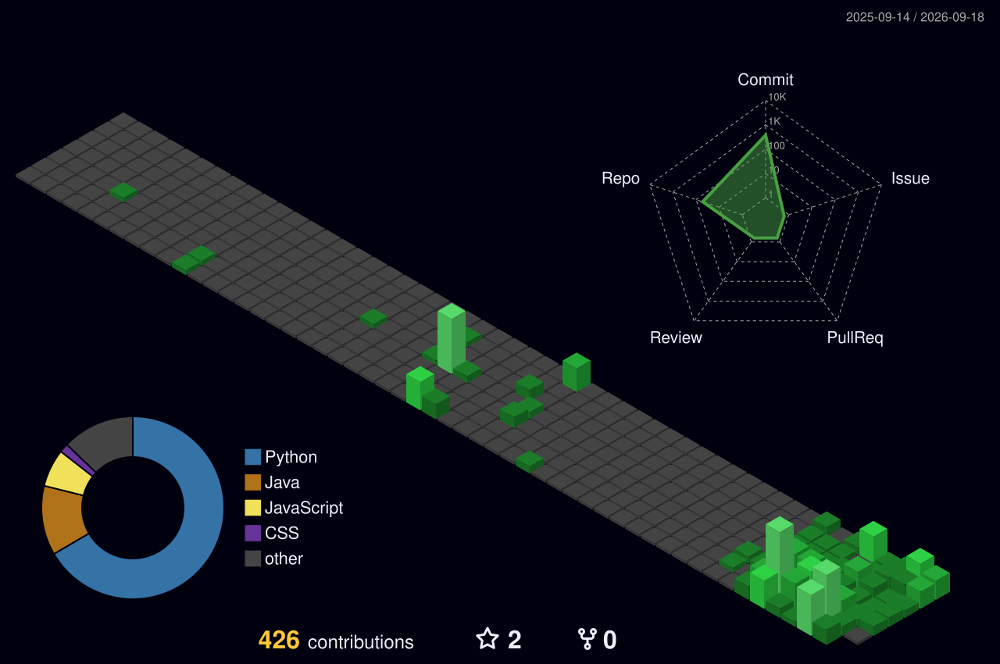

<h1>👋 Hi, I'm Cherukuri Venkatesh</h1>

<h3>Java Backend Developer • Data Science & Engineering for AI • Problem Solver</h3>

 

> **Building scalable backend systems with Spring Boot, engineering AI-driven data solutions, and solving complex algorithmic challenges through consistency, discipline, and continuous learning. 🚀**

 

  

  

  

  <!--
  
  -->

---

## 💫 About Me

I'm a **Computer Science & Engineering (Honors)** student specializing in **Data Science & Engineering for Artificial Intelligence**, driven by a passion for building scalable backend systems, engineering intelligent data solutions, and solving complex algorithmic challenges.

I believe that great software is built on **strong fundamentals, disciplined execution, and continuous learning**. My journey is focused on mastering the technologies that power modern data-driven applications—from backend architecture and high-performance databases to cloud platforms and AI-enabled systems.

Rather than simply learning frameworks, I strive to understand **how large-scale software is designed, optimized, and deployed**. Every project I build is an opportunity to write cleaner code, improve system design skills, and become a better engineer.

---

## 🚀 Current Focus

- 🧩 Strengthening **Data Structures & Algorithms** through consistent problem solving.
- ☕ Building scalable backend applications using **Java, Spring Boot, REST APIs, and PostgreSQL**.
- 🐍 Advancing my expertise in **Python** and modern libraries for **Data Analysis, Data Engineering, and AI workflows**.
- 🗄️ Deepening my knowledge of **SQL**, database design, query optimization, and data modeling.
- ☁️ Gaining hands-on experience with **AWS** and **Microsoft Azure** to build cloud-native applications.
- 🌍 Exploring emerging technologies with curiosity, adaptability, and an open mindset to build the future.
- 💪 Believing that consistency, discipline, and continuous learning are the foundations of becoming an exceptional software engineer.

---

> **"Consistency builds mastery. Curiosity drives innovation. Discipline turns ideas into impactful engineering."** 🚀

---

## 🛠 Tech Stack

### ☕ Backend Development

  
  
  
  
  
  
  
  
  

### 💻 Programming Languages

  
  
  
  

### 🗄️ Databases & Data Engineering

  
  
  
  

### 📊 Data Science & AI

  
  
  
  
  
  

### ☁️ Cloud & DevOps

  
  
  
  
  

### 🌐 Frontend Development

  
  
  
  
  
  
  

### 🛠 Developer Ecosystem

  
  
  
  
  
  
  
  
  
  
  

---

## 📊 GitHub Statistics

---

## 🔥 GitHub Streak

---

## 📈 3D Contribution Graph

---

## 🏆 Achievements & Highlights

- 🏅 Solved **1000+ coding problems on CodeChef**, earning a **2★ Programmer** rating through consistent competitive programming and advanced algorithmic problem solving.
- 🚀 Participated in **Smart India Hackathon (2×)**, **Adobe India Hackathon**, and **Flipkart GRID**, contributing to innovative solutions in national-level software engineering and innovation competitions.
- 👥 Demonstrated **leadership** across academic projects and hackathons by driving collaboration, taking technical ownership, and delivering high-quality solutions in team-oriented environments.
- 🌱 Driven by **consistency, discipline, resilience, adaptability, and lifelong learning**, with a passion for solving complex problems, building scalable software, and exploring emerging technologies.

---

## 🤝 Coding Profiles & Connect

<table>
<tr>

<td width="62%" align="center">

<h3>💻 LeetCode Statistics</h3>

 

  

</td>

<td width="38%" align="center">

<h3>🔗 Connect</h3>

  

&nbsp;&nbsp;

  

&nbsp;&nbsp;

</td>

</table>

---

## 💭 Quote of the Day

<!---->
---

